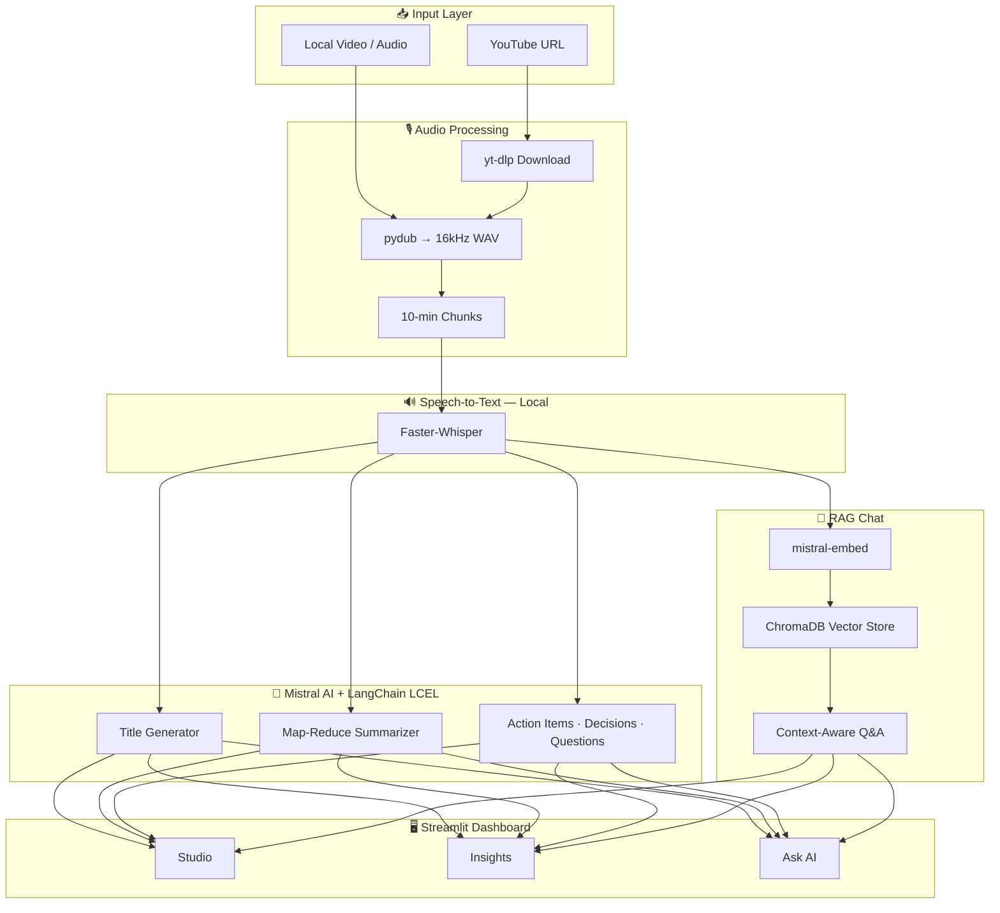

<div align="center">


<a href="https://git.io/typing-svg">
  
</a>

<br/>

<p>
  
  
  
  
  
  
</p>

<p>
  
  
  
  
  
</p>

</div>

<br/>

## 🎯 What Is Nexus AI?

**Nexus AI** is a premium meeting intelligence platform that transforms video and audio into structured, actionable knowledge. Drop in a YouTube link or local recording — the system transcribes speech locally, summarizes with Mistral, extracts decisions and action items, and lets you **chat with the meeting** through a retrieval-augmented pipeline.

> Hybrid by design: **local speech-to-text** keeps transcription free and private, while **Mistral AI** powers summarization, extraction, embeddings, and conversational Q&A.

<br/>

## ⚡ Six-Stage Intelligence Pipeline

```
┌─────────────┐   ┌──────────────┐   ┌─────────────┐   ┌──────────────┐   ┌─────────────┐   ┌──────────┐
│  1. Audio   │ → │ 2. Whisper   │ → │ 3. Title    │ → │ 4. Summary   │ → │ 5. Extract  │ → │ 6. RAG   │
│  Ingestion  │   │ Transcription│   │ Generation  │   │  (Map-Reduce)│   │  Insights   │   │  Engine  │
└─────────────┘   └──────────────┘   └─────────────┘   └──────────────┘   └─────────────┘   └──────────┘
 yt-dlp / pydub    faster-whisper      Mistral LLM        Mistral LLM         Mistral LLM      ChromaDB
 FFmpeg chunking   CPU · int8           8-word title       bullet summary      3 extractors     + Mistral
```

<br/>

## 🧠 Architecture



<br/>

## ✨ Capabilities

| Module | What You Get |
| :--- | :--- |
| **Smart Transcription** | Local Faster-Whisper on CPU — English & Hinglish modes |
| **Executive Summary** | Map-reduce summarization across long transcripts |
| **Auto Title** | Professional meeting title generated from content |
| **Action Items** | Tasks with owner and deadline when mentioned |
| **Key Decisions** | Numbered list of decisions made during the meeting |
| **Open Questions** | Unresolved topics flagged for follow-up |
| **RAG Chat** | Ask natural-language questions grounded in the transcript |
| **Exports** | Download transcript, actions, decisions, and questions as `.txt` |
| **Session History** | Timeline of analyses within the current browser session |

<br/>

## 🖥️ Dashboard

<table>
<tr>
<td align="center" width="25%">
<b>🏠 Home</b><br/>
<sub>Feature overview & recent activity</sub>
</td>
<td align="center" width="25%">
<b>⚡ Studio</b><br/>
<sub>Source input & pipeline launcher</sub>
</td>
<td align="center" width="25%">
<b>📊 Insights</b><br/>
<sub>Summary, metrics & extractions</sub>
</td>
<td align="center" width="25%">
<b>💬 Ask AI</b><br/>
<sub>RAG-powered meeting chat</sub>
</td>
</tr>
<tr>
<td align="center">
<b>🕐 History</b><br/>
<sub>Session timeline (last 20 runs)</sub>
</td>
<td align="center">
<b>⚙️ Settings</b><br/>
<sub>Language defaults & session reset</sub>
</td>
<td align="center">
<b>❓ Help</b><br/>
<sub>Quick start & FAQs</sub>
</td>
<td align="center">
<b>📈 Live Stepper</b><br/>
<sub>Real-time pipeline progress</sub>
</td>
</tr>
</table>

<br/>

## 🛠️ Tech Stack

<details open>
<summary><b>Full stack breakdown</b></summary>

<br/>

| Layer | Technology | Role |
| :--- | :--- | :--- |
| **UI** | Streamlit, custom CSS | Multi-page dashboard with glass-morphism theme |
| **Ingestion** | yt-dlp, pydub, FFmpeg | YouTube download, format conversion, chunking |
| **STT** | Faster-Whisper, ctranslate2, PyTorch | Local transcription on CPU (`int8`) |
| **LLM** | Mistral AI (`mistral-small-2506`) | Summaries, titles, extractions, chat |
| **Orchestration** | LangChain LCEL | Prompt chains, map-reduce, RAG pipeline |
| **Embeddings** | Mistral Embed | Semantic indexing of transcript chunks |
| **Vector DB** | ChromaDB | Persistent retrieval store (`vector_db/`) |
| **Config** | python-dotenv | API keys and model settings via `.env` |

</details>

<br/>

## 📁 Project Structure

```
Video Agent/
├── app.py                  # Streamlit dashboard entry point
├── main.py                 # CLI pipeline + interactive chat loop
├── requirements.txt
├── .env.example
├── cookies.txt             # Optional — YouTube auth cookies
│
├── core/
│   ├── transcriber.py      # Faster-Whisper load & transcribe
│   ├── summarizer.py       # Map-reduce summary + title generation
│   ├── extractor.py        # Action items, decisions, questions
│   ├── rag_engine.py       # LCEL RAG chain + ask_question()
│   └── vector_store.py     # ChromaDB build / load / retriever
│
├── services/
│   ├── pipeline.py         # Streamlit pipeline orchestration
│   └── session.py          # Session state, pages, history
│
├── ui/
│   ├── navigation.py       # Sidebar shell & routing
│   ├── components.py       # Reusable UI blocks
│   ├── styles.py           # Global CSS injection
│   └── pages/              # home · studio · insights · chat · history · settings · help
│
├── utils/
│   └── audio_processor.py  # Download, convert, chunk audio
│
└── downloads/              # YouTube audio cache (runtime)
```

<br/>

## 🚀 Quick Start

### Prerequisites

- **Python 3.10+**
- **FFmpeg** installed and available on `PATH`
- **Mistral API key** — [console.mistral.ai](https://console.mistral.ai/)

### Install

```bash
git clone https://github.com/SalikAhmad702/Video-Agent.git
cd Video-Agent

# Using uv (recommended)
uv venv
uv pip install -r requirements.txt

# Or standard pip
python -m venv .venv
.venv\Scripts\activate        # Windows
pip install -r requirements.txt
```

### Configure

Copy `.env.example` to `.env` and set your keys:

```env
MISTRAL_API_KEY=your_mistral_api_key_here
WHISPER_MODEL=base
```

| Variable | Default | Description |
| :--- | :--- | :--- |
| `MISTRAL_API_KEY` | — | Required for LLM, embeddings, and chat |
| `WHISPER_MODEL` | `base` | Whisper size: `tiny`, `base`, `small`, `medium`, `large-v3` |
| `YTDLP_COOKIE_FILE` | `cookies.txt` | Optional path to YouTube cookies for restricted videos |

### Run

**Web dashboard (recommended):**

```bash
streamlit run app.py
```

**CLI mode:**

```bash
python main.py
```

<br/>

## 📖 Usage Guide

### Web UI

1. Open **Studio** from the sidebar
2. Paste a **YouTube URL** or absolute **local file path** (`C:/videos/meeting.mp4`)
3. Select **English** or **Hinglish** transcription mode
4. Click **Run Analysis** — watch the live pipeline stepper
5. Review output in **Insights** — summary, transcript, extractions, downloads
6. Switch to **Ask AI** — chat with suggested prompts or custom questions

### CLI

```bash
python main.py
# Enter YouTube URL or local file path when prompted
# Chat loop starts automatically after analysis — type 'exit' to quit
```

### Supported Sources

| Source | Formats | Notes |
| :--- | :--- | :--- |
| YouTube | Any URL | Uses yt-dlp; optional `cookies.txt` for sign-in videos |
| Local files | MP4, MP3, WAV, etc. | Converted via pydub → 16 kHz mono WAV |

<br/>

## 🔬 How It Works

<details>
<summary><b>Transcription — local & free</b></summary>

Audio is split into **10-minute chunks** and processed by **Faster-Whisper** on CPU with `int8` quantization. The model loads once and is reused across chunks. Hinglish mode enables Whisper's translate task for Hindi-English code-mixed speech.

</details>

<details>
<summary><b>Summarization — map-reduce pattern</b></summary>

Long transcripts are split into 3 000-character segments. Each chunk is summarized independently, then a final Mistral pass merges partial summaries into one cohesive bullet-point executive summary.

</details>

<details>
<summary><b>Extraction — specialized prompts</b></summary>

Three dedicated LangChain chains run against the full transcript:
- **Action items** — task, owner, deadline
- **Key decisions** — numbered decision log
- **Open questions** — unresolved follow-ups

</details>

<details>
<summary><b>RAG Chat — grounded answers only</b></summary>

The transcript is chunked (500 chars, 50 overlap), embedded with **mistral-embed**, and stored in **ChromaDB**. At query time, the top-4 similar chunks are retrieved and passed as context to Mistral — answers stay tied to the meeting content.

</details>

<br/>

## ⚙️ Configuration Reference

```env
# Required
MISTRAL_API_KEY=sk-...

# Optional — Whisper model size (larger = more accurate, slower)
WHISPER_MODEL=small

# Optional — custom cookie file for YouTube
YTDLP_COOKIE_FILE=C:/path/to/cookies.txt
```

**Whisper model trade-offs:**

| Model | Speed | Accuracy | RAM |
| :--- | :---: | :---: | :---: |
| `tiny` | ⚡⚡⚡ | ★★ | ~1 GB |
| `base` | ⚡⚡ | ★★★ | ~1 GB |
| `small` | ⚡ | ★★★★ | ~2 GB |
| `medium` | 🐢 | ★★★★★ | ~5 GB |

<br/>

## 🗺️ Roadmap

- [x] YouTube + local file ingestion
- [x] Faster-Whisper local transcription (English / Hinglish)
- [x] Map-reduce summarization with Mistral
- [x] Action items, decisions, and questions extraction
- [x] ChromaDB RAG chat with mistral-embed
- [x] Streamlit dashboard with live pipeline stepper
- [x] Transcript & extraction `.txt` downloads
- [ ] PDF export (reportlab / fpdf2 — deps ready)
- [ ] Hindi → English translation layer (deep-translator — dep ready)
- [ ] Persistent analysis history across sessions
- [ ] Speaker diarization (who said what)
- [ ] Docker & Streamlit Cloud deployment guide

<br/>

## 🤝 Contributing

Contributions welcome — especially PDF export, speaker diarization, and deployment configs.

```bash
git checkout -b feature/your-improvement
git commit -m "feat: describe your change"
git push origin feature/your-improvement
```

Open a pull request when ready.

<br/>

## 📄 License

Free and open source — use, modify, and distribute freely.

- ✅ Personal, academic, and commercial use
- ⚠️ Provided **as-is** without warranty

---


## 📧 Let's Connect

<div align="center">

<h3>Built with obsession by <b>Salik Ahmad</b> 🤖</h3>

<p>
  <a href="https://salikahmad.vercel.app/" target="_blank">
    
  </a>
  <a href="https://www.linkedin.com/in/salik-ahmad-programmer/" target="_blank">
    
  </a>
  <a href="https://www.kaggle.com/salikahmad702" target="_blank">
    
  </a>
  <a href="https://github.com/SalikAhmad702" target="_blank">
    
  </a>
</p>

<br/>

<a href="https://salikahmad.vercel.app/">
  
</a>

<br/><br/>


</div>
